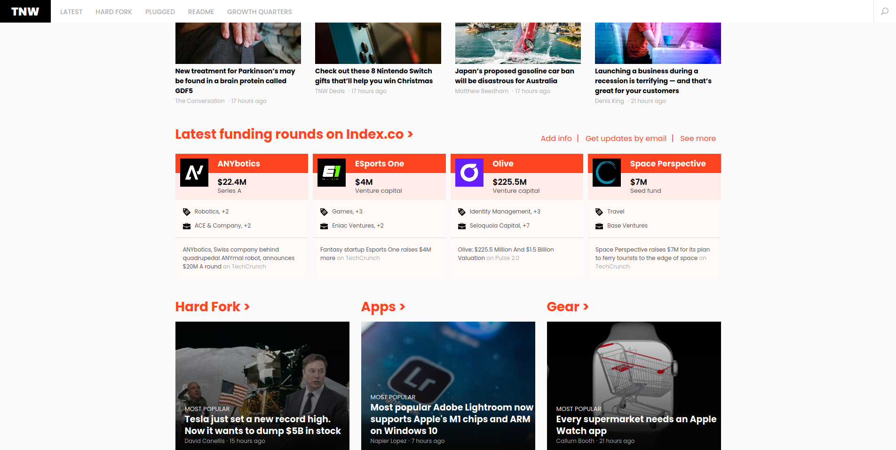

# Responsive Design

In this project for [The Odin Project](https://www.theodinproject.com) I cloned [The Next Web homepage](https://thenextweb.com/). The goal was to make this page responsive. My clone relies heavily on grid for the main layout, which expands at the breakpoints of 768px width and 1024px width, while the headers and footers as well as some smaller elements use flexbox.

## Demo

[View it here](https://reinimax.github.io/responsive-design/)
